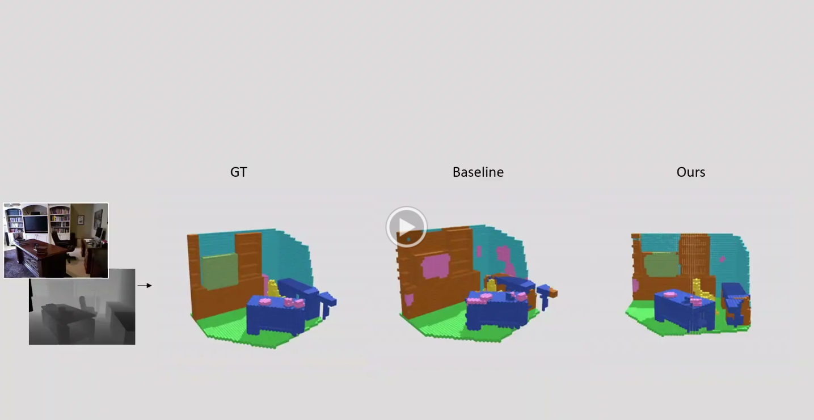

The following demo shows the predicted 3D models from the NYUCAD dataset, using different MDBNet components on the NYUCAD dataset to assess the progression of each element.
.

## Setup
### Hardware Requirement
At least one NVIDIA GPU with 32GB RAM.
### Environmet Setup
- conda install pytorch==2.0.0 torchvision==0.15.0 torchaudio==2.0.0 pytorch-cuda=11.8 -c pytorch -c nvidia
- conda install -c conda-forge tqdm
- conda install -c conda-forge tensorboard
- conda install -c conda-forge scikit-image
- conda install -c conda-forge scikit-learn
- conda install -c conda-forge pandas
- conda install -c conda-forge numpy
- conda install -c conda-forge opencv
- conda install matplotlib                             #optional

## Datasets
- To download the NYU and NYUCAD depth maps and the 3D ground truth semantics, we use those used by SSCNet paper available in: https://github.com/shurans/sscnet/blob/master/download_data.sh
- The RGB images for available at:
train_url = "http://www.doc.ic.ac.uk/~ahanda/nyu_train_rgb.tgz"
test_url = "http://www.doc.ic.ac.uk/~ahanda/nyu_test_rgb.tgz"
- The 2D semantics labels available at: http://horatio.cs.nyu.edu/mit/silberman/nyu_depth_v2/nyu_depth_v2_labeled.mat 
To extract the 2d labels for NYUCAD dataset as an example:

`run python extract_nyu_2d_labels.py --dataset NYUCAD`
- The data are organized as:                     
      
           |-- NYUtrain
                             |-- NUYxxxx_0000.bin // 3D labels GT
                             |-- NUYxxxx_0000.png // Depth map
                             |-- NUYxxxx_0000_labels.png // Gray scale 2D semantics
                             |-- NUYxxxx_0000_labels_rgb.png 
                             |-- NUYxxxx_0000_colors.png // RGB image
           |-- NYUtest
                             |-- NUYxxxx_0000.bin 
                             |-- NUYxxxx_0000.png 
                             |-- NUYxxxx_0000_labels.png
                             |-- NUYxxxx_0000_labels_rgb.png 
                             |-- NUYxxxx_0000_colors.png
           |-- NYUCADtrain
                             |-- NUYxxxx_0000.bin 
                             |-- NUYxxxx_0000.png 
                             |-- NUYxxxx_0000_labels.png
                             |-- NUYxxxx_0000_labels_rgb.png 
                             |-- NUYxxxx_0000_colors.png
           |-- NYUCADtest
                             |-- NUYxxxx_0000.bin 
                             |-- NUYxxxx_0000.png 
                             |-- NUYxxxx_0000_labels.png
                             |-- NUYxxxx_0000_labels_rgb.png 
                             |-- NUYxxxx_0000_colors.png
  
### Data Preprocessing
To generate 3D volumes for training and evaluating the MDBNet model:

1. compile the CUDA code: 

   `nvcc -std=c++11 --ptxas-options=-v --compiler-options '-fPIC' -o lib_preproc.so --shared lib_preproc.cu`
   
3. To process the 3D volumes use `run_job.sh`, or run:

   `python preproc_tsdf.py --base_path './directory_path_to_be_processed' --dest_path './directory_path_of_processed_data'`

   Ex on NYUCAD:

   `python preproc_tsdf.py --base_path './data/NYUCADtest' --dest_path './data/NYUCAD_test_preproc'`

### SSC Training
1. Downloand the pretrained model Segformer 'B5' available at: https://huggingface.co/nvidia/segformer-b5-finetuned-ade-640-640/tree/main .

2. For training MDBNet model, use `run_t_job.sh`, or run:  

Example on NYUCAD: 

`python train.py --dataset NYUCAD --model_name ResUNet_rgb --fusion late --expr_name xxxx --train_batch_size 4 --val_batch_size 2 --base_lr_2d 0.0001 --base_lr_3d 0.01 --decay_2DModel 0.05 --decay_3DModel 0.0005 --epochs 100`

### SSC Evaluaion
For MDBNet evaluation, use `run_e_job.sh`, or run:  
 
Example on NYUCAD: 

`python evaluation.py --dataset NYUCAD --model_name ResUNet_rgb --fusion late --expr_name xxxx --weights_2D "./saved_models/2D_pretrained_late_path1.pth" "./saved_models/2D_pretrained_late_path2.pth" "./saved_models/2D_pretrained_late_path3.pth"  --weights_3D "./saved_models/ResUNet_rgb_late_path1.pth" "./saved_models/ResUNet_rgb_late_path2.pth" "./saved_models/ResUNet_rgb_late_path3.pth"`

### 3D SSC Object Generation
To generate the 3D scenes for GT and predictions. Use `run_obj_job.sh`, or run:  

`python 3d_obj_gen.py --model_name ResUNet --expr_name xxxx --gt_path './NYU_gt_pred/' --output_path './obj/' --weights "./saved_models/path1.pth"`

Example on NYUCAD: 

`python 3d_obj_gen.py --model_name ResUNet_rgb --fusion late --expr_name xxxx --gt_path './NYUCAD_gt_pred/' --output_path './obj/' --weights_2D "./saved_models/2D_pretrained_late_path1.pth" --weights_3D "./saved_models/ResUNet_rgb_late_path1.pth"`
